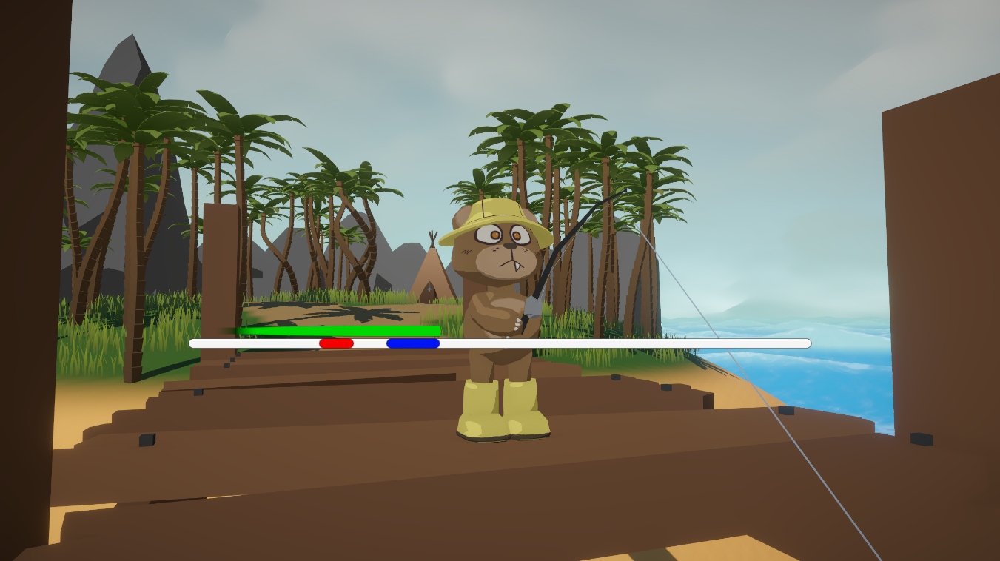

needa add images one sec and we can change a bit this is just the rough draft

-need to add one section for the toon shader
-need images of like the deafualt gerstner movement or something
-need to reside that one giant concpet art image

# Bearly Afloat

**Bearly Afloat** is a stylized fishing adventure game built over the course of a semester.  
Our team of four designed, developed, and implemented every aspect of the project—from concept art to final gameplay—while gaining hands-on experience with industry-relevant tools and techniques.

---

## 🗺️ Overview

**Bearly Afloat** combines stylized visuals, dynamic wave physics, and handcrafted art to create a chill, relaxing fishing experince. Throughout the development process, we focused on performance, playability, and visuals.

---

## 🌊 Wave Physics

To simulate realistic ocean movement, we implemented **Gerstner wave formulas** in our **shader graph**. These mathematical models allowed us to recreate lifelike wave motion, which we fine-tuned to achieve smooth and natural behavior.

---

## 🌊 Wave Visuals

To ensure performance efficiency, we used **normal maps** in our shaders to simulate small-scale surface details—such as ripples and minor waves. This technique gave the illusion of complexity without the need for heavy computations.

---

## ☁️ Cloud Effects

We generated dynamic cloudscapes by overlaying a custom mesh across the skybox.  
Using **Voronoi noise**, we created randomized cloud patterns and displacement effects, resulting in the appearance of massive, drifting clouds—all with minimal computational cost.

---

## 🎭 Character Design & Animation

We began with concept brainstorming and visual planning, followed by creating detailed character models.  
Once finalized, we rigged and animated them in **Blender**, ensuring expressive and fluid movement that fits the game’s stylized world.

---

## 🎨 Sprites & Art Style

All 2D sprites were hand-drawn in **Procreate on an iPad**, giving the game a cohesive, hand-drawn aesthetic.  
This art style helped define the game’s personality and guided our overall visual direction.

---

## 🎮 Game Mechanics

We implemented core gameplay systems entirely from scratch, including:

- Character movement  
- Inventory management  
- Interaction systems  
- Shop system (buying and selling)  
- Fishing system with randomized fish types and difficulty levels

